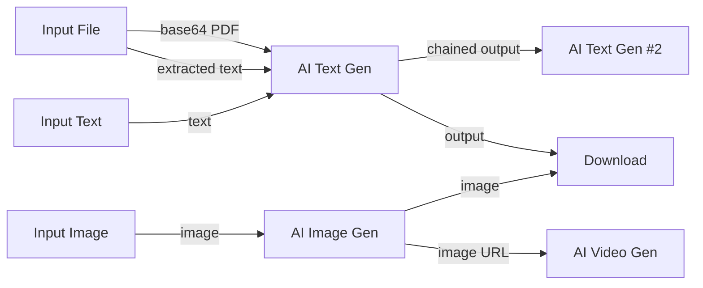

<p align="center">
  
  
  
  
  
</p>

# ⚡ FlowForge

**Visual AI Workflow Builder — Xây dựng pipeline AI bằng kéo-thả, không cần code.**

FlowForge là một ứng dụng web client-side cho phép bạn thiết kế, kết nối và chạy các pipeline AI phức tạp thông qua giao diện đồ họa trực quan (node-based). Kết nối với **400+ model AI** từ OpenRouter (GPT-4o, Claude, Gemini, Llama, Flux, Luma,...) — tất cả chạy trực tiếp trên trình duyệt, không cần backend.

---

## 🖼️ Tổng quan

```
┌─────────────────────────────────────────────────────────────┐
│  TopBar (Tên workflow · Auto-save · Run · Import/Export)    │
├────┬────────────────────────────────────────────────┬───────┤
│    │                                                │       │
│ T  │            ✦ Canvas Workspace ✦                │ Pro-  │
│ o  │                                                │ per-  │
│ o  │   [Input Text] ──→ [AI Text Gen] ──→ [Down-   │ ties  │
│ l  │                         │              load]   │ Panel │
│ b  │   [Input File] ────────┘                       │       │
│ a  │                                                │       │
│ r  │   [Input Image] ──→ [AI Image Gen]             │       │
│    │                                                │       │
├────┴─────────────────────────┬──────────────────────┴───────┤
│  ZoomControls                │  Recenter Button             │
└──────────────────────────────┴──────────────────────────────┘
```

---

## ✨ Tính năng chính

### 🧩 Node-based Visual Editor
- **Kéo-thả** để tạo và sắp xếp các node trên canvas vô hạn.
- **Kết nối dây** (edges) giữa các node để xây dựng luồng dữ liệu.
- **Zoom & Pan** mượt mà bằng cuộn chuột, kéo thả, hoặc cử chỉ cảm ứng.
- **Undo/Redo** không giới hạn với `Ctrl+Z` / `Ctrl+Shift+Z`.
- **Multi-select** node bằng `Ctrl+Click`.

### 🤖 Tích hợp 400+ Model AI qua OpenRouter
- **Text Generation:** GPT-4o, Claude 3.5 Sonnet, Gemini 2.0, Llama 3.1, DeepSeek, Qwen,...
- **Image Generation:** DALL·E 3, Stable Diffusion XL, Flux, Midjourney,...
- **Video Generation:** Luma Dream Machine, Runway Gen-3, MiniMax,...
- **Audio / Speech / Embeddings / Rerank** — hỗ trợ đầy đủ các loại modality.
- Duyệt model theo **provider** và **category** ngay trong ứng dụng.
- Hỗ trợ nhiều API key cùng lúc, đặt tên và chuyển đổi nhanh.

### 📄 Trích xuất nội dung File thông minh
- Upload trực tiếp: `.pdf`, `.docx`, `.doc`, `.txt`, `.md`, `.csv`, `.json`, `.xml`, `.html`.
- **PDF:** Trích xuất text qua `pdfjs-dist` + giữ base64 cho các model hỗ trợ đọc PDF gốc (Claude).
- **DOCX:** Chuyển đổi sang text thuần qua `mammoth`.
- Nội dung file được tự động format sang **Markdown** trước khi gửi API — giúp LLM đọc hiểu chính xác hơn.

### 💾 Lưu trữ & Đồng bộ
- **Auto-save** liên tục vào `localStorage` + `IndexedDB`.
- **Multi-workflow:** Tạo, lưu, và chuyển đổi giữa nhiều workflow.
- **Import/Export:** Xuất workflow dưới dạng JSON, import lại bất kỳ lúc nào.
- **Google Drive Sync:** Đồng bộ workflow lên Google Drive (OAuth2).
- **Recovery Mode:** Khôi phục workflow từ bản backup IndexedDB khi mất dữ liệu.

### 📱 Tối ưu Cảm ứng (Mobile & Tablet)
- **Pinch-to-Zoom:** Chụm 2 ngón tay để thu phóng canvas.
- **1-Finger Pan:** Vuốt 1 ngón trên vùng trống để di chuyển góc nhìn.
- **Enlarged Touch Targets:** Vùng chạm port kết nối mở rộng 36×36px.
- **Viewport meta** chặn browser zoom để trải nghiệm mượt như app native.

### ⌨️ Phím tắt chuyên nghiệp
| Phím | Hành động |
|------|-----------|
| `Ctrl+Z` | Undo |
| `Ctrl+Shift+Z` | Redo |
| `Delete` / `Backspace` | Xóa node/edge đang chọn |
| `Space` (giữ) | Chuyển sang chế độ Pan |
| `Ctrl+S` | Lưu workflow |
| `?` | Mở/đóng bảng phím tắt |

---

## 🗂️ Các loại Node

| Node | Mô tả | Đầu vào | Đầu ra |
|------|--------|---------|--------|
| **📝 Input Text** | Nhập văn bản tự do | — | Text |
| **🖼️ Input Image** | Upload ảnh | — | Image URL |
| **📄 Other Input (File)** | Upload file (PDF, DOCX, TXT,...) | — | Extracted Text |
| **🤖 AI Text Gen** | Gọi LLM để sinh văn bản | Text + File | Generated Text |
| **🎨 AI Image Gen** | Gọi model AI tạo ảnh | Text Prompt | Image |
| **🎬 AI Video Gen** | Gọi model AI tạo video | Text + Image | Video |
| **📥 Download** | Tải output về máy | Any output | File download |
| **📌 Note** | Ghi chú trên canvas | — | — |

---

## 🏗️ Kiến trúc dự án

```
flowforge/
├── index.html                    # Entry point + viewport meta
├── package.json                  # Dependencies & scripts
├── tailwind.config.js            # Tailwind CSS configuration
├── tsconfig.json                 # TypeScript configuration
├── vite.config.ts                # Vite build configuration
│
└── src/
    ├── main.tsx                  # React DOM entry
    ├── App.tsx                   # Root layout & routing
    ├── index.css                 # Global styles & CSS variables
    │
    ├── engine/                   # 🔧 Canvas Engine (core)
    │   ├── canvasEngine.ts       #   Node/edge/viewport state machine
    │   └── useCanvasEngine.ts    #   React hook for engine subscription
    │
    ├── store/                    # 📦 State Management (Zustand)
    │   ├── workflowStore.ts      #   Primary store (workflows, API keys, settings)
    │   ├── toastStore.ts         #   Toast notification store
    │   └── modelCatalog.ts       #   AI model metadata catalog
    │
    ├── services/                 # 🌐 External Services
    │   ├── openRouterApi.ts      #   OpenRouter API client (models, chat, image gen)
    │   ├── fileExtractor.ts      #   Client-side file parsing (PDF, DOCX, TXT)
    │   ├── mediaStorage.ts       #   IndexedDB media blob storage
    │   └── googleDriveApi.ts     #   Google Drive OAuth2 + file sync
    │
    ├── hooks/                    # 🪝 Custom React Hooks
    │   ├── useAutoSave.ts        #   Periodic auto-save to localStorage/IDB
    │   ├── useKeyboardShortcuts.ts #  Global keyboard shortcut handler
    │   └── useTouchGestures.ts   #   Touch pinch-zoom & pan gestures
    │
    ├── components/               # 🧱 UI Components
    │   ├── TopBar.tsx            #   App header (name, save, run, import/export)
    │   ├── Toolbar.tsx           #   Floating tool palette (left sidebar)
    │   ├── Canvas.tsx            #   Canvas wrapper
    │   ├── PropertiesPanel.tsx   #   Node property editor (right panel)
    │   ├── ZoomControls.tsx      #   Zoom +/−/reset/fit buttons
    │   ├── RecenterButton.tsx    #   Quick recenter viewport button
    │   ├── AddNodePopover.tsx    #   Add node menu + model browser
    │   ├── SettingsModal.tsx     #   Settings (API keys, storage, Drive sync)
    │   ├── ImageLibraryModal.tsx #   Saved images browser
    │   ├── RecoveryModal.tsx     #   Workflow recovery from backups
    │   ├── ShortcutGuide.tsx     #   Keyboard shortcut overlay
    │   ├── ToastContainer.tsx    #   Custom toast notifications
    │   ├── ModelSelector.tsx     #   Model picker dropdown
    │   │
    │   ├── canvas/               #   Canvas internals
    │   │   └── CanvasRenderer.tsx #    Node/edge rendering + pointer events
    │   │
    │   ├── nodes/                #   Custom node components
    │   │   ├── AITextGenNode.tsx
    │   │   ├── AIImageGenNode.tsx
    │   │   ├── AIVideoGenNode.tsx
    │   │   ├── InputTextNode.tsx
    │   │   ├── InputImageNode.tsx
    │   │   ├── InputFileNode.tsx
    │   │   ├── NoteNode.tsx
    │   │   ├── NoteFrameNode.tsx
    │   │   └── UtilDownloadNode.tsx
    │   │
    │   └── properties/           #   Node property forms
    │       ├── TextGenProperties.tsx
    │       ├── ImageGenProperties.tsx
    │       ├── VideoGenProperties.tsx
    │       ├── FileProperties.tsx
    │       └── DownloadProperties.tsx
    │
    └── types/                    # 📐 TypeScript type definitions
```

---

## 🚀 Cài đặt & Chạy

### Yêu cầu
- **Node.js** ≥ 18
- **npm** ≥ 9

### Cài đặt

```bash
# Clone repository
git clone https://github.com/<your-username>/flowforge.git
cd flowforge

# Cài dependencies
npm install
```

### Chạy Development Server

```bash
npm run dev
```

Mở trình duyệt tại `http://localhost:5173`

### Build Production

```bash
npm run build
```

Output được tạo trong thư mục `dist/`, sẵn sàng deploy lên bất kỳ hosting tĩnh nào (Vercel, Netlify, GitHub Pages, Cloudflare Pages,...).

### Preview Production Build

```bash
npm run preview
```

---

## ⚙️ Cấu hình

### OpenRouter API Key

1. Đăng ký tài khoản tại [openrouter.ai](https://openrouter.ai/).
2. Tạo API Key tại [openrouter.ai/keys](https://openrouter.ai/keys).
3. Trong FlowForge, mở **Settings** (⚙️) → dán API Key → **Test & Save**.
4. Hỗ trợ quản lý **nhiều API key** cùng lúc — đặt tên, chuyển đổi nhanh giữa các key.

### Google Drive Sync (tuỳ chọn)

1. Tạo Google Cloud project → bật Google Drive API.
2. Tạo OAuth2 Client ID (Web application).
3. Trong FlowForge Settings → nhập Client ID → **Authorize**.
4. Workflow sẽ được sync lên Google Drive dưới dạng JSON.

---

## 🛠️ Tech Stack

| Layer | Công nghệ | Vai trò |
|-------|-----------|---------|
| **UI Framework** | React 19 | Component-based rendering |
| **Language** | TypeScript 6.0 | Type safety |
| **Build Tool** | Vite 8.1 | Dev server + production bundling |
| **Styling** | Tailwind CSS 3.4 | Utility-first CSS |
| **State** | Zustand 4.5 + Zundo | Global state + undo/redo middleware |
| **Animation** | Framer Motion 11.5 | Smooth transitions & micro-animations |
| **Icons** | Lucide React | Consistent icon set |
| **PDF Parser** | pdfjs-dist 6.1 | Client-side PDF text extraction |
| **DOCX Parser** | Mammoth 1.12 | Client-side Word document parsing |
| **Storage** | idb 8.0 (IndexedDB) | Persistent media & workflow storage |
| **AI Gateway** | OpenRouter API | Access to 400+ AI models |
| **Cloud Sync** | Google Drive API | Workflow backup & sync |
| **Linter** | OxLint | Fast Rust-based linting |

---

## 📐 Luồng hoạt động (Data Flow)



1. **Người dùng** tạo các node Input (text, ảnh, file) và kết nối tới các node AI.
2. **Canvas Engine** phân tích DAG (Directed Acyclic Graph) để xác định thứ tự thực thi.
3. Mỗi node AI gửi request tới **OpenRouter API** với prompt được tổng hợp từ tất cả input kết nối.
4. Output được hiển thị trực tiếp trên node và có thể chain sang node tiếp theo.
5. Kết quả cuối cùng có thể tải về qua node **Download**.

---

## 🤝 Đóng góp

Mọi đóng góp đều được chào đón! Để bắt đầu:

1. **Fork** repository này.
2. Tạo branch mới: `git checkout -b feature/ten-tinh-nang`
3. Commit thay đổi: `git commit -m "Add: mô tả ngắn"`
4. Push và tạo **Pull Request**.

### Quy tắc commit
```
feat:     Tính năng mới
fix:      Sửa lỗi
refactor: Tái cấu trúc code (không thay đổi hành vi)
style:    Thay đổi CSS/UI
docs:     Cập nhật tài liệu
perf:     Tối ưu hiệu suất
```

---

## 📄 License

Dự án này được phát hành dưới giấy phép [MIT License](LICENSE).

---

<p align="center">
  <strong>FlowForge</strong> — Biến ý tưởng thành pipeline AI, chỉ bằng kéo-thả. ⚡
</p>
